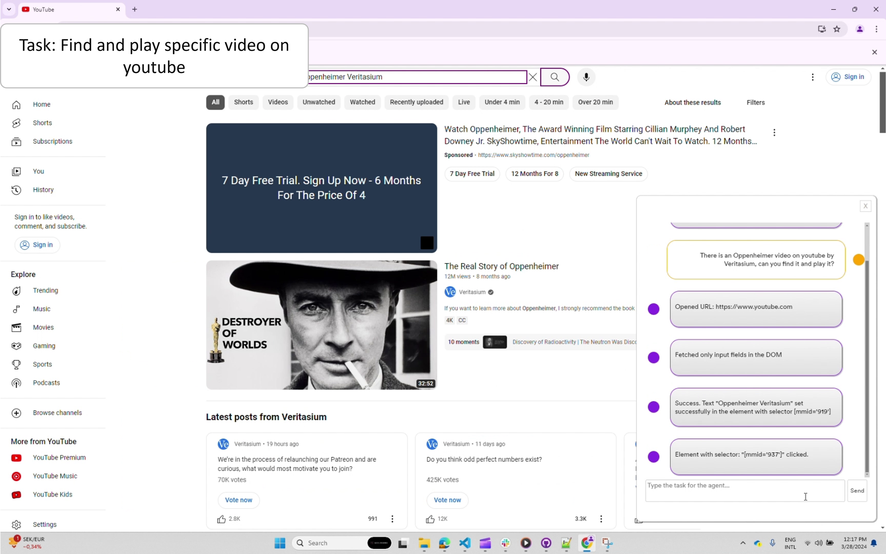
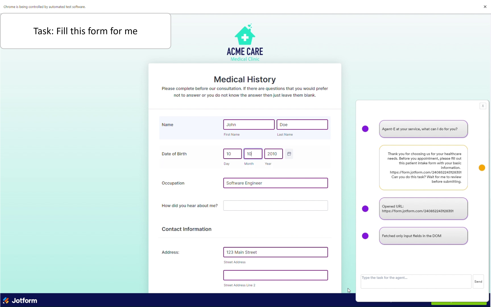

# Agent-E
📚 [Cite paper](https://arxiv.org/abs/2407.13032)


Agent-E is an agent based system that aims to automate actions on the user's computer. At the moment it focuses on automation within the browser. The system is based on on [AutoGen agent framework](https://github.com/microsoft/autogen).

This provides a natural language way to interacting with a web browser:
- Fill out forms (web forms not PDF yet) using information about you or from another site
- Search and sort products on e-commerce sites like Amazon based on various criteria, such as bestsellers or price.
- Locate specific content and details on websites, from sports scores on ESPN to contact information on university pages.
- Navigate to and interact with web-based media, including playing YouTube videos and managing playback settings like full-screen and mute.
- Perform comprehensive web searches to gather information on a wide array of topics, from historical sites to top local restaurants.
- Manage and automate tasks on project management platforms (like JIRA) by filtering issues, easing the workflow for users.
- Provide personal shopping assistance, suggesting products based on the user's needs, such as storage options for game cards.

While Agent-E is growing, it is already equipped to handle a versatile range of tasks, but the best task is the one that you come up with. So, take it for a spin and tell us what you were able to do with it. For more information see our [blog article](https://www.emergence.ai/blog/distilling-the-web-for-multi-agent-automation).


## Quick Start

### Setup
- install `uv` https://github.com/astral-sh/uv
    - macOS/Linux: `curl -LsSf https://astral.sh/uv/install.sh | sh`
    - Windows: `powershell -c "irm https://astral.sh/uv/install.ps1 | iex"`
    - Alternatively you can use pip  `pip install uv`
- Create `uv venv --python 3.11` (`3.10+` should work)
- Activate the virtual enviroment: `source .venv/bin/activate` (Windows: `.venv\Scripts\activate`)
- Generate the requirements.txt from toml file: `uv pip compile pyproject.toml -o requirements.txt`
- Install the generated requirements file: `uv pip install -r requirements.txt`
- To install extras/dev dependancies: `uv pip install -r pyproject.toml --extra dev`
- If you do not have Google Chrome locally (and don't want to install it), install playwright drivers: `playwright install`
- .env file in project root is needed with the following (sample `.env-example` is included for convience):
    - Follow the directions in the sample file
    - You will need to set `AUTOGEN_MODEL_NAME` (We recommend using `gpt-4-turbo` for optimal performance) and `AUTOGEN_MODEL_API_KEY`. 
    - If you are using a model other than OpenAI, you need to set `AUTOGEN_MODEL_BASE_URL` for example `https://api.groq.com/openai/v1` or `https://<REPLACE_AI_SERVICES>.openai.azure.com` on [Azure](https://azure.microsoft.com/).
    - For [Azure](https://azure.microsoft.com/), you'll also need to configure `AUTOGEN_MODEL_API_TYPE=azure` and `AUTOGEN_MODEL_API_VERSION` (for example `2023-03-15-preview`) variables.
    - If you want to use local chrome browser over playwright browser, go to chrome://version/ in chrome, find the path to your profile and set `BROWSER_STORAGE_DIR` to the path value

### pip issues
If you run into an issue where pip is not installed in the virtual env, you can take the following steps:
1. activate the venv
2. `python -m ensurepip --upgrade` This will install pip
3. Deactivate the venv: `deactivate`
4. Activate the venv again
5. If you look in the `.venv/bin` dir you will not see pip3. At this point, you do not have pip, but you have `pip3`

### Blocking IO issues:
If you are on mac and you are getting _BlockingIOError: [Errno 35] write could not complete without blocking_ when autogen tries to print large amont of text:
- Run python with `-u` command `python -u -m ae.main` which will make it unbuffered and the issue will go away. However, there is a change that not all the output will be in the terminal.

### User preferences
To personalize this agent, there is a need for Long Term Memory (LTM) that tracks user preferences over time. For the time being we provide a user preferences free form text file that acts as a static LTM. You can see a sample [here](ae/user_preferences/user_preferences.txt). Feel free to customize this file as you wish making it more personal to you. This file might move to `.gitignore` in future changes.

### Run the code:
`python -m ae.main` (if you are on a Mac, `python -u -m ae.main` See blocking IO issues above)
Once the program is running,  you should see an icon on the browser. The icon expands to chat-like interface where you can enter natural language requests. For example, `open youtube`, `search youtube for funny cat videos`, `find Nothing Phone 2 on Amazon and sort the results by best seller`, etc.


## Demos

| Video | Command | Description |
|-----------|-------------|-------------|
| [](https://www.youtube.com/embed/v4BgYiDHNZs) | There is an Oppenheimer video on youtube by Veritasium, can you find it and play it? | <ul> <li>Navigates to www.youtube.com </li> <li>Searches for Oppenheimer Veritasium using the searchbar </li> <li> Plays the correct video </li></ul>|
| [](https://www.youtube.com/embed/uyE7tfKkB0E) | Can you do this task? Wait for me to review before submitting. | Takes the highlighted text from the email as part of the instruction. <ul> <li>Navigates to the form URL </li> <li>Identifies elements in the form to fill </li> <li> Fills the form using information from memory defined in user preferences.txt </li> <li>Waits for user to review before submitting the form </li> |
| [](https://www.youtube.com/embed/CiKZwU_F6TQ) | Find Finish dishwasher detergent tablets on amazon, sort by best seller and add the first one to my cart | <ul> <li> Navigates to www.amazon.com </li> <li>Searches for Finish dishwasher detergent tablets using amazon search feature </li> <li> Sorts the search results by best seller </li> <li>Selects the first product to navigate to the the product page of the first product. </li> <li> Adds the product to cart </li></ul> |
| [](https://www.youtube.com/embed/JDtnMx0pTmQ) | Compare business class flight options from Lisbon to Singapore for a one-way trip on September 15, 2024 on Google Flights? | <ul><li>  </li> <li> Sets Journey type to one-way. </li> <li> Sets number of passengers to one. </li> <li> Sets departure date to 15 September </li> <li> Sets date to September 15 2024 </li> <li> Sets ticket type to business class </li> <li> Executes search </li> <li> Sets departure date to 15 September </li> Extracts flight information</ul>|


## Architecture


Building on the foundation provided by the [AutoGen agent framework](https://github.com/microsoft/autogen), Agent-E's architecture leverages the interplay between skills and agents. Each skill embodies an atomic action, a fundamental building block that, when executed, returns a natural language description of its outcome. This granularity allows Agent-E to flexibly assemble these skills to tackle complex web automation workflows.


The diagram above shows the configuration chosen on top of AutoGen. The skills can be partitioned differently, but this is the one that we chose for the time being. We chose to use skills that map to what humans learn about the web browser rather than allow the LLM to write code as it pleases. We see the use of configured skills to be safer and more predictable in its outcomes. Certainly it can click on the wrong things, but at least it is not going to execute malicious unknown code.

### Agents
At the moment there are two agents, the User proxy (executes the skills), and Browser navigation. Browser navigation agent embodies all the skills for interacting with the web browser.

### Skills Library
At the core of Agent-E's capabilities is the Skills Library, a repository of well-defined actions that the agent can perform; for now web actions. These skills are grouped into two main categories:

- **Sensing Skills**: Skills like `get_dom_with_content_type` and `geturl` that help the agent understand the current state of the webpage or the browser.
- **Action Skills**: Skills that allow the agent to interact with and manipulate the web environment, such as `click`, `enter text`, and `open url`.

Each skill is created with the intention to be as conversational as possible, making the interactions with LLMs more intuitive and error-tolerant. For instance, rather than simply returning a boolean value, a skill might explain in natural language what happened during its execution, enabling the LLM to better understand the context and correct course if necessary.

Below are the skills we have implemented:

| Sensing Skills | Action Skills |
|----------------|---------------|
| `geturl` - Fetches and returns the current url. | `click` - given a DOM query selector, this will click on it. |
| `get_dom_with_content_type` - Retrieves the HTML DOM of the active page based on the specified content type. Content type can be:<br> - `text_only`: Extracts the inner text of the html DOM. Responds with text output.<br> - `input_fields`: Extracts the interactive elements in the DOM (button, input, textarea, etc.) and responds with a compact JSON object.<br> - `all_fields`: Extracts all the fields in the DOM and responds with a compact JSON object. | `enter_text_and_click` - Optimized method that combines enter text and click skills. The optimization here helps use cases such as enter text in a field and press the search button. Since the DOM would not have changed or changes should be immaterial to this action, identifying both selectors for an input field and an actionable button can happen based on the same DOM examination. |
| `get_user_input` - Provides the orchestrator with a mechanism to receive user feedback to disambiguate or seek clarity on fulfilling their request. | `bulk_enter_text` - Optimized method that wraps enter_text method so that multiple text entries can be performed one shot. |
|  | `enter_text` - Enters text in a field specified by the provided DOM query selector. |
|  | `openurl` - Opens the given URL in current or new tab. |


### DOM Distillation

Agent-E's approach to managing the vast landscape of HTML DOM is methodical and, frankly, essential for efficiency. We've introduced DOM Distillation to pare down the DOM to just the elements pertinent to the user's task.

In practice, this means taking the expansive DOM and delivering a more digestible JSON snapshot. This isn't about just reducing size, it's about honing in on relevance, serving the LLMs only what's necessary to fulfill a request. So far we have three content types:

- **Text only**: For when the mission is information retrieval, and the text is the target. No distractions.
- **Input fields**: Zeroing in on elements that call for user interaction. It’s about streamlining actions.
- **All content**: The full scope of distilled DOM, encompassing all elements when the task demands a comprehensive understanding.

It's a surgical procedure, carefully removing extraneous information while preserving the structure and content needed for the agent’s operation. Of course with any distillation there could be casualties, but the idea is to refine this over time to limit/eliminate them.

Since we can't rely on all web page authors to use best practices, such as adding unique ids to each HTML element, we had to inject our own attribute (`mmid`) in every DOM element. We can then guide the LLM to rely on using `mmid` in the generated DOM queries.

To cutdown on some of the DOM noise, we use the DOM Accessibility Tree rather than the regular HTML DOM. The accessibility tree by nature is geared towards helping screen readers, which is closer to the mission of web automation than plain old HTML DOM.

The distillation process is a work in progress. We look to refine this process and condense the DOM further aiming to make interactions faster, cost-effective, and more accurate.


## Testing and benchmarking

We build on the work done by [Web Arena](https://github.com/web-arena-x/webarena) for testing and evaluation. The `test` directory contains a `tasks` sub directory with a JSON file, which contains test cases that also act as examples. Not all of them will pass.
While Web Arena creates a set of static and controlled sites, we opted for using the wild web to bring the experience closer to what we all experience on a daily basis. This comes with pluses and minuses of course.

Note: WebArena uses openai for some test validation strategies, for that reason `OPENAI_API_KEY` must be set in `.env` file

### Run examples/tests:
This will take time to run. Alternatlively to run a particular example(s), modify the min and max task indicies.
`python -m test.run_tests` (if you are on a Mac `python -u -m test.run_tests`)

#### Parameters for run_tests:
    - `--min_task_index`: Minimum task index to start tests from (default: 0)
    - `--max_task_index`: Maximum task index to end tests with, non-inclusive
    - `--test_results_id`: A unique identifier for the test results. If not provided, a timestamp is used
    - `--test_config_file`: Path to the test configuration file. Default is "test/tasks/test.json" in the project root.
    - `--wait_time_non_headless`: The amount of time to wait between headless tests
    - `--take_screenshots`: Takes screenshots after every operation performed. Example: `--take_screenshots true` Default to `false`
For example: `python -m test.run_tests --min_task_index 0 --max_task_index 28 --test_results_id first_28_tests` _(add `-u` for Mac)_


## Docs generation:

Ensure that dev dependancies are installed before doing this.
1. Go to project root
2. `mkdir docs`
3. `cd docs`
4. `sphinx-quickstart`
5. Modify/add to docs/conf.py the following:
```
import os
import sys
sys.path.insert(0, os.path.abspath('..'))
extensions = ['sphinx.ext.autodoc', 'sphinx.ext.napoleon']
html_theme = 'sphinx_rtd_theme'
```
6. Use api docs style for the generation, from *project root* run: `sphinx-apidoc -o docs/source .`
7. Build the documentation, from `docs` directory, run: `sphinx-build -b html . _build`


## Open-source models

Using open-source models is possible through LiteLLM with Ollama. Ollama allows users to run language models locally on their machines, and LiteLLM translates OpenAI-format inputs to local models' endpoints. To use open-source models as Agent-E backbone, follow the steps below:

1. Install LiteLLM
    ```bash
    pip install 'litellm[proxy]'
    ```
2. Install Ollama
    * For Mac and Windows, download [Ollama](https://ollama.com/download).
    * For Linux:
        ```bash
        curl -fsSL https://ollama.com/install.sh | sh
        ```
3. Pull Ollama models
    Before you can use a model, you need to download it from the library. The list of available models is [here](https://ollama.com/library). Here, we use Mistral v0.3:
    ```bash
    ollama pull mistral:v0.3
    ```
4. Run LiteLLM
    To run the downloaded model with LiteLLM as a proxy, run:
    ```bash
    litellm --model ollama_chat/mistral:v0.3
    ```
5. Configure model in Autogen
    Configure the `.env` file as follows. Note that the model name and API keys are not needed since the local model is already running.
    ```bash
    AUTOGEN_MODEL_NAME=NotRequired
    AUTOGEN_MODEL_API_KEY=NotRequired
    AUTOGEN_MODEL_BASE_URL=http://0.0.0.0:400
    ```
Please note that while it is possible to use local Large Language Models (LLMs) with Agent-E, such setups have not been thoroughly tested. 

## TODO

- Action verification - Responding from every skill with changes that took place in the DOM (Mutation Observers) so that the LLM can judge whether the skill did execute properly or not
- Execution Planner - The LLM can potentially decide on multiple steps ahead, but it typically just sticks with one at a time. A targeted planning agent can make execution faster
- Memory + learn user preferences
- Move user preferences to a local vector DB. Add a skill to query vector DB. Possibly send the user preferences keys into the prompt.
- DOM distillation for content type links
- Voice input
- Replace use of deprecated `snapshot()` for DOM distillation
- Make DOM distillation for all content types even smaller
- Various test cases for DOM distillation to see if it is capturing all the intended elements
- Grow the skills library: Bookmarks, Tab navigation, history, key combination + special keys, ...
- Enable Group chat and move some of the skills to different agents
- Investigate if there is a way to have less tokens used up by the AutoGen required prompts and annotations


## Social:

[Discord](https://discord.gg/wgNfmFuqJF)

## Contributing

Thank you for your interest in contributing! We welcome involvement from the community.

Please visit our [contributing guidelines](CONTRIBUTING.md) for more details on how to get involved.

## Citation

If you use this work, please cite our article:

```
@misc{abuelsaad2024-agente,
      title={Agent-E: From Autonomous Web Navigation to Foundational Design Principles in Agentic Systems},
      author={Tamer Abuelsaad and Deepak Akkil and Prasenjit Dey and Ashish Jagmohan and Aditya Vempaty and Ravi Kokku},
      year={2024},
      eprint={2407.13032},
      archivePrefix={arXiv},
      primaryClass={cs.AI},
      url={https://arxiv.org/abs/2407.13032},
}
```
